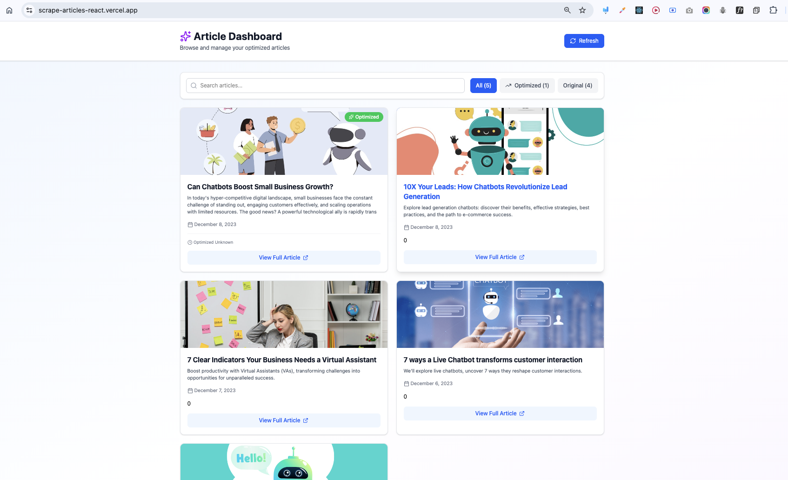
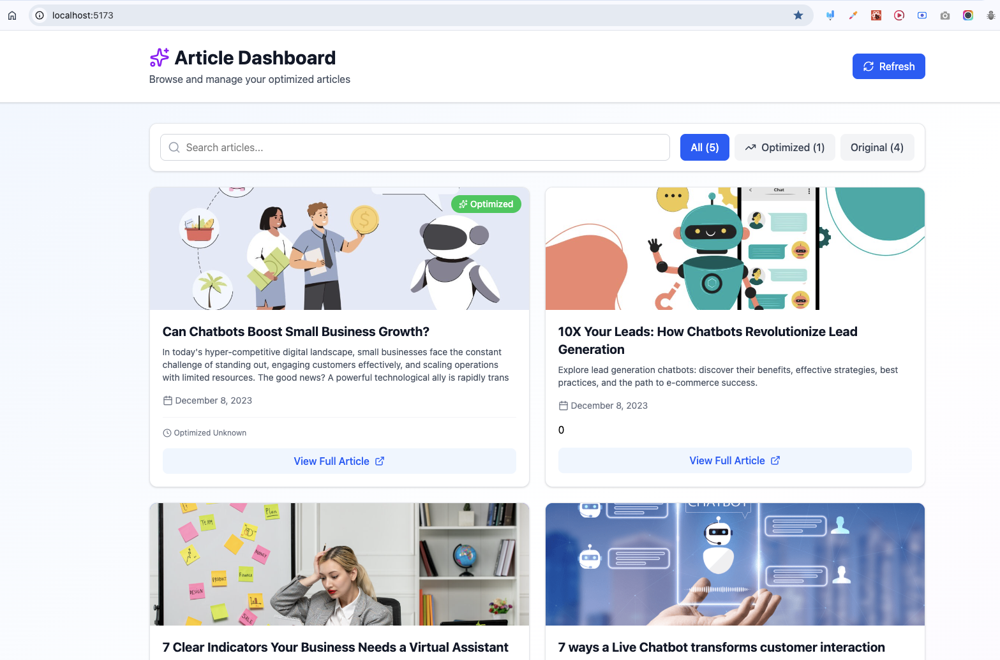

📦 Installation
Clone the Repository
bashgit clone https://github.com/firoz-akhter/beyondchats-scraper.git
beyondchats-scraper

<!-- -------------------------------------- -->

article-update-node
bashcd article-update-node
npm install

Copy and configure environment variables

cp .env.example .env

Edit .env with your configuration

npm start OR npm run dev OR node src/index.js

<!-- ---------------------------------------------- -->

scrape-article-react
bashcd scrape-article-react
npm install
npm run dev

<!-- --------------------------------------------------- -->

scrape-php
composer install

Configure your PHP environment and database settings

Start PHP server

php -S localhost:8000

<!-- --------------------------------- -->

⚙️ Configuration
Each project require its own configuration:

<!-- --------------------------------- -->

article-update-node: Configure database connections and API keys in .env
in .env file we need below keys
PORT=3000
NODE_ENV=development
LARAVEL_API_URL=http://localhost:8000/api
GOOGLE_GEMINI_API_KEY=<your generated gemini api>
GOOGLE_API_KEY=<your generated api>
GOOGLE_SEARCH_ENGINE_ID=<your generated api>

<!-- --------------------------------- -->

scrape-article-react: Simply npm i and then npm run dev(vite-tailwind setup project)
.env file not needed

<!-- --------------------------------- -->

scrape-php: Update database credentials and scraping settings in configuration files
simply copy this in .env file and don't forget composer install
APP_NAME=Laravel
APP_ENV=local
APP_KEY=base64:ICYrP2SI0Bp5N6XFAJrRgw4EirBBt7rqgW5inaUeWD4=
APP_DEBUG=true
APP_URL=http://localhost

APP_LOCALE=en
APP_FALLBACK_LOCALE=en
APP_FAKER_LOCALE=en_US

APP_MAINTENANCE_DRIVER=file

# APP_MAINTENANCE_STORE=database

# PHP_CLI_SERVER_WORKERS=4

BCRYPT_ROUNDS=12

LOG_CHANNEL=stack
LOG_STACK=single
LOG_DEPRECATIONS_CHANNEL=null
LOG_LEVEL=debug

DB_CONNECTION=mysql
DB_HOST=127.0.0.1
DB_PORT=3306
DB_DATABASE=laravel
DB_USERNAME=root
DB_PASSWORD=

SESSION_DRIVER=file
SESSION_LIFETIME=120
SESSION_ENCRYPT=false
SESSION_PATH=/
SESSION_DOMAIN=null

BROADCAST_CONNECTION=log
FILESYSTEM_DISK=local
QUEUE_CONNECTION=database

CACHE_STORE=database

# CACHE_PREFIX=

MEMCACHED_HOST=127.0.0.1

REDIS_CLIENT=phpredis
REDIS_HOST=127.0.0.1
REDIS_PASSWORD=null
REDIS_PORT=6379

MAIL_MAILER=log
MAIL_SCHEME=null
MAIL_HOST=127.0.0.1
MAIL_PORT=2525
MAIL_USERNAME=null
MAIL_PASSWORD=null
MAIL_FROM_ADDRESS="hello@example.com"
MAIL_FROM_NAME="${APP_NAME}"

AWS_ACCESS_KEY_ID=
AWS_SECRET_ACCESS_KEY=
AWS_DEFAULT_REGION=us-east-1
AWS_BUCKET=
AWS_USE_PATH_STYLE_ENDPOINT=false

VITE_APP_NAME="${APP_NAME}"

<!-- --------------------------------- -->

🔄 Workflow

scrape-php

1. Scrape and save articles from beyondChats and save to the mysql database
2. provide api for creat, read, update and delete articles
   scrape-article-react provides the UI to trigger and monitor scraping
3. fetches and and show data using React UI
   article-update-node processes and updates article data in the database
4. run once using node src/index.js and
5. it will fetch the latest article from our scrape-php
6. searches for two similar articles(google search)
7. update the article using gemini 2.5
8. update the scrape-php saved article into mysql database

👥 Authors
Firoz Akhter

📞 Support
For support, please open an issue in the repository
or you can mail to: firozakhter789@gmail.com

IN order to run the frontend successfully we should run the scraper-php locally on our machine because vercel hosted React UI is connected with localhost:8000/api

